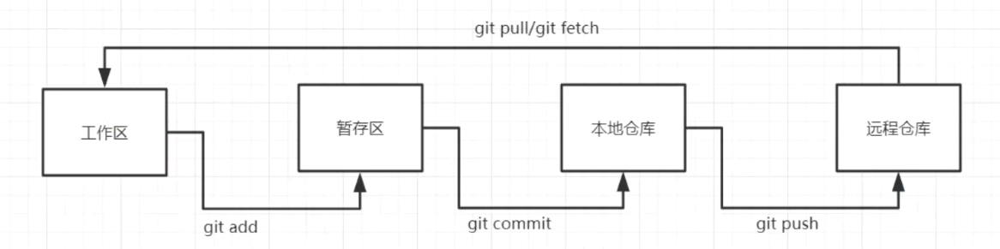

## 基本配置

```
1. 在path中添加
   D:\Dev\PortableGit-2.34.1-64-bit\bin
   D:\Dev\PortableGit-2.34.1-64-bit\mingw64\libexec\git-core
2. 设置用户名和邮箱
   git config --global user.name "gaoxingxs"    # 名称
   git config --global user.email "gaoxingxs@live.com"   # 邮箱
3. 生成公钥
   1. 进入到用户文件加下：cd C:\Users\GGX
   2. 新建.ssh文件夹：mkdir .ssh
   3. 执行命令：ssh-keygen -t rsa 连续三下回车
   4. 输入命令，查看公钥信息：cat ~/.ssh/id_rsa.pub
   5. 将公钥信息public key 添加到码云账户中即可！
```

## 基本命令

```bash
# 克隆项目
git clone ssh链接

# 查看当前项目的状态
git status

# 提交到暂存区
# git add 文件名: 指定提交的文件
# git add .: 提交全部
git add

# 提交到本地仓库
git commit -m '提交信息'

# 指定提交到的分支
git push origin master

# 从仓库的指定分支拉取文件
git pull origin master

# 创建并切换到分支
git checkout -b dev
# git checkout -b dev相当于两条指令
git branch dev # 创建分支 branch：分支
git checkout dev # 切换到dev分支

# 创建分支之后将内容重新提交到新的分支
git push origin dev

# 合并分支
git merge 分支名称

# 合并冲突
# 1. 在dev分支修改内容，git add .  git commit -m '在dev分支修改'
# 2. 切换到pro分支
# 3. 在pro分支修改内容，git add .  git commit -m '在皮肉分支修改'
# 4. 执行 git merge dev , 就会出现合并冲突，这时可以选择保留当前分支内容，保留传入分支内容，合并内容
# 5. 合并后继续git add. git commit git push origin dev ，


# 版本回退
git log  #查看当前项目提交过的所有版本
git log --pretty=oneline  # 查看所有提交过的版本，只显示版本号

git reset --hard 版本号 # 回退到执行版本，版本号只写前几位即可

# 删除分支
git branch -D dev;//删除本地master分支
git push origin :dev;//删除远程master分支

# 删除文件
git rm 文件名
```

‍
## 使用代理

```sh
# 仅在当前命令生效
git clone https://github.com/gaoxingxs/gaoxingxs.github.io.git --config "http.proxy=http://127.0.0.1:2081"

# 对特定仓库生效，在仓库中执行：
git config http.proxy http://127.0.0.1:2081

# 全局配置
git config --global http.proxy http://127.0.0.1:2081

# 取消全局代理设置
git config --global --unset http.proxy

# 取消特定仓库代理设置
git config --unset http.proxy
```
‍
